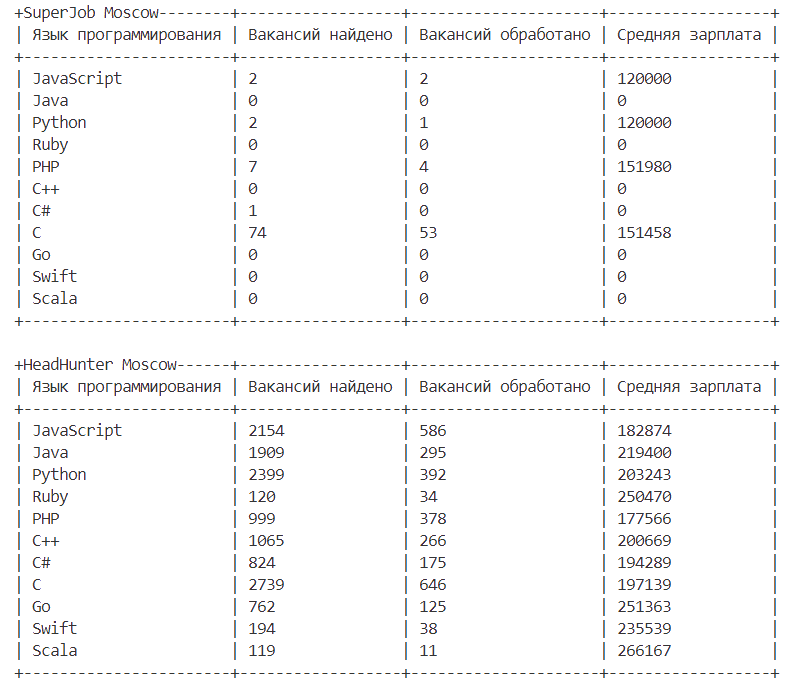

# Сравниваем вакансии программистов

Данный проект содержит скрипт, который считает среднюю зарплату программистов самых популярных языков программирования с сайтов HeadHunter и SuperJob. Зарплата указывается в рублях.

### Как установить

Скачайте репозиторий и установите Python пакеты из `requirements.txt`:
```bash
git clone https://github.com/AlexRikka/devman_devs_avg_salary.git
cd devman_space_images_bot
pip install -r requirements.txt
```
Для взаимодействия с SuperJob API необходимо зарегестрировать приложение и получить токен по инструкции из [документации SuperJob API](https://api.superjob.ru/). Создайте в папке с проектом файл `.env` и добавьте токен в него:
```
SUPERJOB_API_KEY=<ваш токен>
```

Запустите скрипт командой:
```
python main.py
```

### Пример работы скрипта



### Цель проекта

Код написан в образовательных целях на онлайн-курсе для веб-разработчиков [dvmn.org](https://dvmn.org/).
